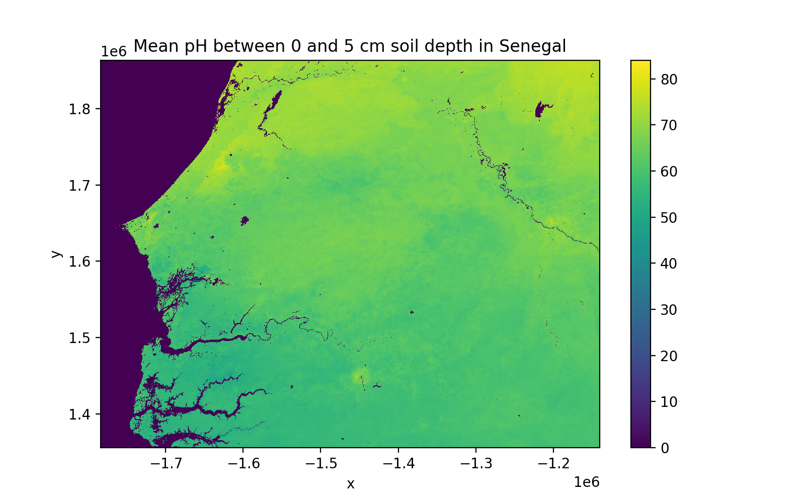

`pymt_soilgrids <https://github.com/gantian127/pymt_soilgrids>`_ converts `soilgrids <https://soilgrids.readthedocs.io/en/latest/?badge=latest>`_ into a reusable,
plug-and-play data component for `PyMT <https://pymt.readthedocs.io/en/latest/?badge=latest>`_ modeling framework.
pymt_soilgrids allows the soil datasets to be easily coupled with other datasets or models that expose
a `Basic Model Interface <https://bmi.readthedocs.io/en/latest/>`_.

Installation
------------

Install the pymt in a new environment:

.. code::

  $ conda config --add channels conda-forge
  $ conda create -n pymt -c conda-forge python=3 pymt
  $ conda activate pymt

Install the pymt_soilgrids using pip:

.. code::

  $ pip install pymt_soilgrids

or conda:

.. code::

  $ conda install -c conda-forge pymt_soilgrids

Coding Example
--------------
You can learn more details from the `tutorial notebook <https://github.com/gantian127/pymt_soilgrids/blob/master/notebooks/pymt_soilgrids.ipynb>`_.

.. code-block:: python

    import matplotlib.pyplot as plt
    import numpy as np

    from pymt.models import SoilData

    # initiate a data component
    data_comp = SoilData()
    data_comp.initialize('config_file.yaml')

    # get variable info
    var_name = data_comp.output_var_names[0]
    var_unit = data_comp.var_units(var_name)
    var_location = data_comp.var_location(var_name)
    var_type = data_comp.var_type(var_name)
    var_grid = data_comp.var_grid(var_name)

    print('variable_name: {} \nvar_unit: {} \nvar_location: {} \nvar_type: {} \nvar_grid: {}'.format(
        var_name, var_unit, var_location, var_type, var_grid))

    # get variable grid info
    grid_type = data_comp.grid_type(var_grid)
    grid_rank = data_comp.grid_ndim(var_grid)
    grid_shape = data_comp.grid_shape(var_grid)
    grid_spacing = data_comp.grid_spacing(var_grid)
    grid_origin = data_comp.grid_origin(var_grid)

    print('grid_type: {} \ngrid_rank: {} \ngrid_shape: {} \ngrid_spacing: {} \ngrid_origin: {}'.format(
        grid_type, grid_rank, grid_shape, grid_spacing, grid_origin))

    # get variable data
    data = data_comp.get_value(var_name)
    data_2D = data.reshape(grid_shape)

    print(data.shape, data_2D.shape)

    # get X, Y extent for plot
    min_y, min_x = grid_origin
    max_y = min_y + grid_spacing[0]*(grid_shape[0]-1)
    max_x = min_x + grid_spacing[1]*(grid_shape[1]-1)
    dy = grid_spacing[0]/2
    dx = grid_spacing[1]/2
    extent = [min_x - dx, max_x + dx, min_y - dy, max_y + dy]

    # plot data
    fig, ax = plt.subplots(1,1, figsize=(9,5))
    im = ax.imshow(data_2D, extent=extent, vmin=0)
    fig.colorbar(im)
    plt.xlabel('X')
    plt.ylabel('Y')
    plt.title('Mean pH between 0 and 5 cm soil depth in Senegal')

    # complete the example by finalizing the component
    data_comp.finalize()

|tif_plot|

.. links:

.. |binder| image:: https://mybinder.org/badge_logo.svg
 :target: https://mybinder.org/v2/gh/gantian127/pymt_soilgrids/master?filepath=notebooks%2Fpymt_soilgrids.ipynb

